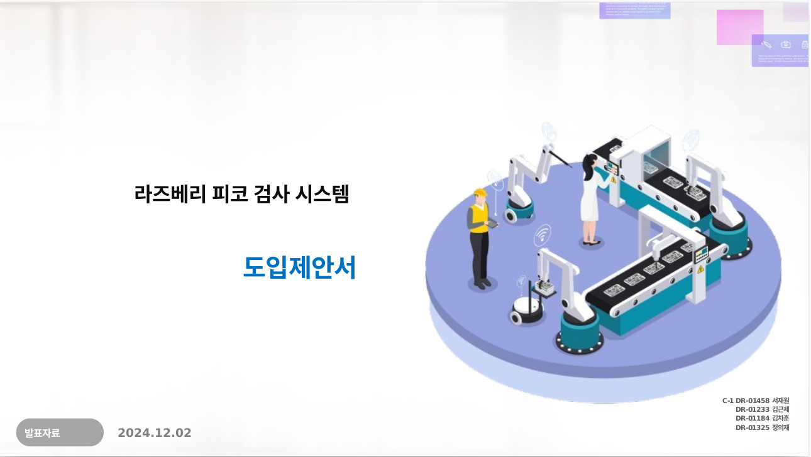
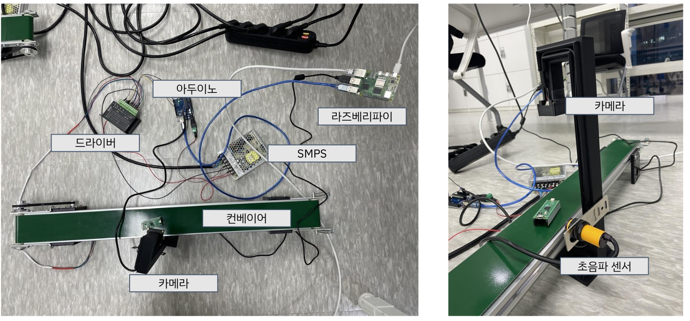

# 라즈베리 피코 검사 시스템

본 프로젝트는 **라즈베리 피코 기반 품질 검사 자동화 시스템** 구축을 목표로 합니다.

## 발표 자료 
[](docs/발표자료.pdf)

## 📌 프로젝트 개요
- **프로젝트명**: 라즈베리 피코 검사 시스템
- **발표일**: 2024.12.02
- **팀명**: C-1조
- **팀원**: 서재원, 김근제, 김차훈, 정의재

## 🎯 프로젝트 목표
- 경제적이고 효율적인 **자동화 품질 검사 시스템** 도입
- ISO9001, ISO 14001, FDA 21 CFR Part 11 등의 **인증제도 취득 대비**
- **실시간 검사 및 모니터링 시스템** 구현
- **저비용, 고효율** 시스템 개발

## ⚙️ 시스템 개요
### ✅ 주요 기능
- 실시간 품질 검사 및 자동화 공정 관리
- 다양한 환경에서 높은 정확도를 유지하는 **AI 기반 모델** 적용
- 후처리 알고리즘을 통한 성능 최적화 (SVD 활용)

### 🖼 실습 환경
  <!-- 실습 환경 이미지 경로 -->

### 📊 성능
- 검사 속도: 시간당 **12,000~14,000장** 처리 가능
- 모델 정확도 (mAP): **87**

## 🛠 사용한 모델 및 기술
| 모델명 | 최신성 | 주요 특징 | 성능 (mAP) | 학습 용이성 |
|--------|--------|------------|------------|------------|
| YOLOv6-N | 2023.05 | 중소형 객체 탐지, 저사양에서도 사용 가능 | 76.2 | 적은 리소스로 학습 가능 |
| YOLOv6-L6 | 2023.07 | 대형 객체 감지, 일부 환경에서 성능 변동 발생 | 83.7 | 고성능 GPU 필수 |
| YOLOv6-M | 2023.06 | 정확도와 속도의 균형, 다양한 크기의 객체 탐지 적합 | 80.7 | 고성능 GPU(A100 권장) |
| YOLO11 nano | 2024.10 | 고성능 GPU 없이도 사용 가능 | 0.3~0.4 | 일반 PC에서 사용 가능 |

## 💡 기대 효과
✅ **생산성 향상** 및 **인력 비용 절감**  
✅ **정확한 결함 감지**로 품질 개선  
✅ **공정 무인화** 및 **실시간 모니터링** 지원  
✅ **장기적으로 사업 확장 가능성** 제공  

## 🔥 리스크 관리
- **데이터 품질 문제** → 고품질 데이터셋 구축
- **소프트웨어 성능 문제** → 지속적인 개선 및 최적화
- **리스크 발생 시 대응 방안 마련**

## 🚀 설치 및 실행 방법
1. 프로젝트를 클론합니다.
   ```bash
   git clone https://github.com/sepengsu/rokey_week4_ws.git
   cd rokey_week4_ws
2. sh 파일을 실행합니다. 


## 🏆 결과물
 
